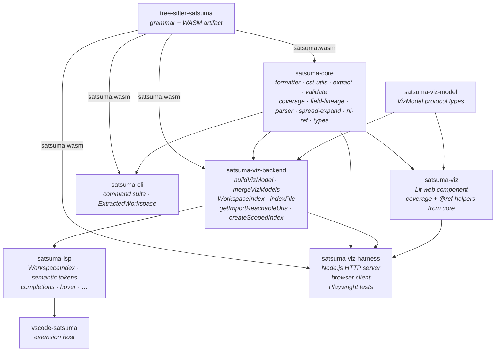
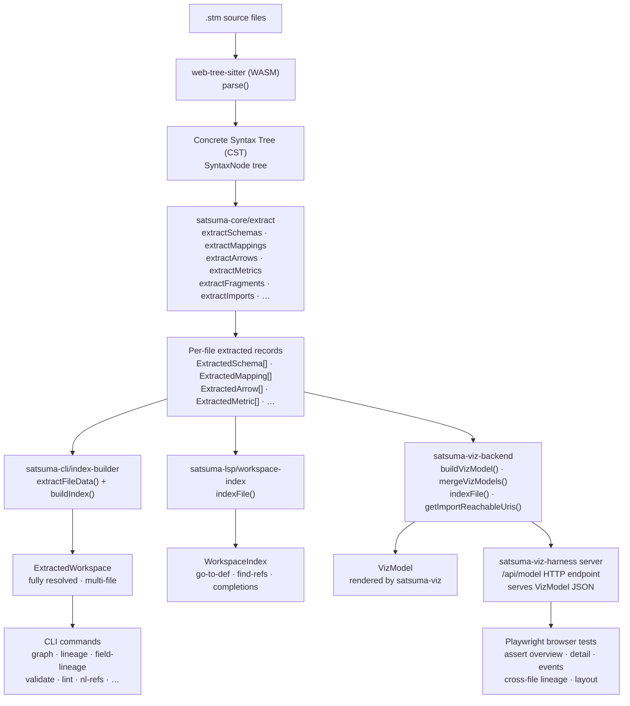
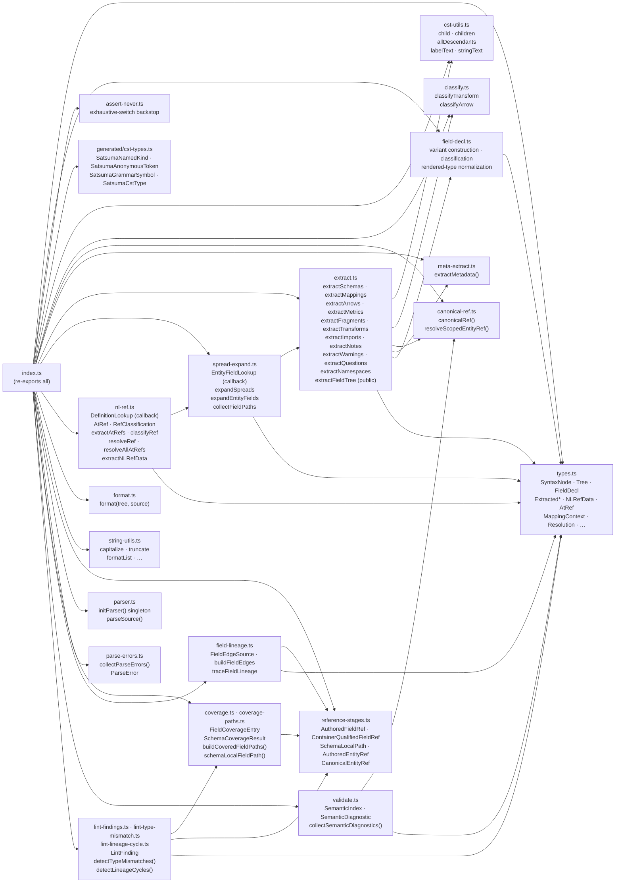
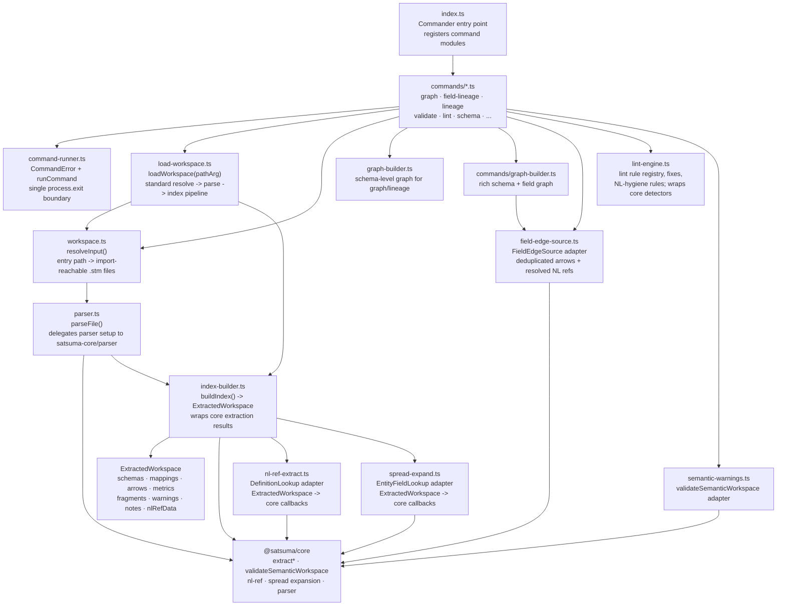
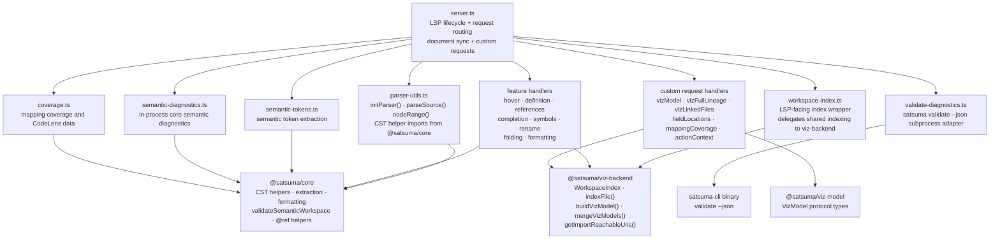
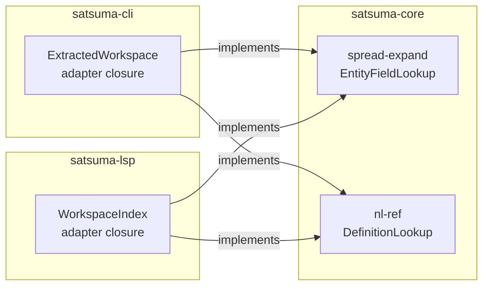

# Satsuma Tooling Architecture

> Last updated: 2026-08-04 — documented shared field-edge assembly and lineage traversal in core.

This document is the canonical architecture reference for the Satsuma language tooling — the packages under `tooling/` that parse, analyse, format, validate, visualize, and provide IDE support for `.stm` files. The design is influenced by [rust-analyzer's architecture](https://rust-analyzer.github.io/book/contributing/architecture.html), adapted for a tree-sitter-backed DSL rather than a full programming language compiler.

See `adrs/` for the architectural decision records that explain the choices made here. `tooling/ARCHITECTURE.md` is intentionally kept as a short pointer to this document so package-local links do not become a second source of truth.

---

## Package Map

The `tooling/` directory contains nine npm packages:

| Package | Role |
|---------|------|
| `tree-sitter-satsuma` | Grammar definition, compiled parser artifacts (WASM), and CST symbol contract generation |
| `satsuma-core` | Shared extraction, formatting, validation, analysis, and generated CST symbol types — the foundation |
| `satsuma-viz-model` | Shared VizModel protocol contract — types for the server→viz JSON payload |
| `satsuma-viz-backend` | Shared VizModel assembly — `buildVizModel`, `mergeVizModels`, workspace index; used by LSP server and viz harness |
| `satsuma-cli` | CLI command suite; consumer of satsuma-core |
| `satsuma-lsp` | Editor-agnostic LSP server; consumer of satsuma-core, satsuma-viz-model, satsuma-viz-backend |
| `satsuma-viz` | Lit web component that renders VizModel as an interactive diagram; consumes satsuma-viz-model and small shared helpers from satsuma-core |
| `vscode-satsuma` | VS Code extension shell; consumer of satsuma-lsp and satsuma-viz |
| `satsuma-viz-harness` | Standalone HTTP harness for fixture-driven browser testing of satsuma-viz; Playwright tests |
| `satsuma-scenario-gen` | **Test-only.** Builds semantic Satsuma scenarios as plain data, renders them to source, and states the ground truth that follows by construction. Depended on *by* other packages' test suites and depends on none of them |

### Package Dependency Diagram



`satsuma-core` and `satsuma-viz-model` have no upward dependencies on consumer packages such as the CLI, LSP, VS Code extension, or viz harness. `satsuma-viz-backend` is the shared boundary between the LSP server and the viz harness — it owns all VizModel assembly logic so neither consumer duplicates it.

The dependency arrows above describe runtime and compile-time package dependencies. At generation time, `tree-sitter-satsuma` also derives the tracked `satsuma-core/src/generated/cst-types.ts` contract from tree-sitter's `node-types.json`. The grammar package owns generation and freshness checks; core owns the public artifact consumed through `@satsuma/core`. See ADR-043.

---

## Design Principles

### 1. Dependencies flow downward

`satsuma-core` never imports from `satsuma-cli`, `satsuma-lsp`, `vscode-satsuma`, or the viz harness. The LSP never imports from the CLI. The CLI never imports from the LSP. `satsuma-viz-backend` is shared by the LSP server and the viz harness — neither imports from the other.

`satsuma-scenario-gen` sits below everything, including core: core's own test suites depend on it, so a dependency back on core would be a build cycle. It is also the one package with no dependency on the toolchain at all, which is what makes it usable as a test oracle — a generated scenario states its own ground truth by construction, so a property that consulted core to decide the expected answer would be asking the code under test to grade itself.

### 2. Parsing never fails

The tree-sitter parser always produces a CST, even for broken or incomplete input. Error nodes are embedded in the tree rather than aborting. Downstream code operates on partial results plus diagnostics so the IDE remains useful while a file is mid-edit.

### 3. Core is pure computation with no I/O

`satsuma-core` has no file-system access, no network calls, no process spawning, no LSP types, and no CLI types. It accepts CST nodes or callback functions and returns plain data. Consumers handle I/O and adapt core results into CLI output, LSP protocol objects, or VizModel payloads.

### 4. Extraction happens once, in core

Every entity type — schema, mapping, fragment, metric, transform, arrow, field, metadata, import, namespace — is extracted from the CST in `satsuma-core`. Consumers call core extractors and adapt the output to their needs. Grammar shape changes should be fixed once in core, not separately in every tool.

### 5. Decouple through callbacks, not shared index types

Core's cross-file operations need access to workspace-wide facts, but each consumer has a different index shape. Core defines minimal callback interfaces such as `EntityFieldLookup`, `DefinitionLookup`, and `SemanticIndex`; CLI and LSP adapters build those callbacks from their own indexes. This keeps core stable without forcing a universal workspace index.

### 6. Keep protocol types out of analysis

Core types such as `FieldDecl`, `ExtractedSchema`, `MetaEntry`, and `Classification` are not serialized directly over LSP or treated as CLI output contracts. Consumers map them explicitly into protocol-facing or display-facing types.

### 7. Test at the right boundary

Extraction logic is tested in core with minimal Satsuma snippets. Consumer tests cover adapter wiring, CLI output, LSP protocol behavior, viz rendering, and end-to-end flows. A consumer test that is really asserting pure extraction belongs in core.

### 8. Graceful degradation over hard failures

An error in one file should not prevent completions, hover, or local navigation elsewhere. Missing workspace data should produce an empty result or diagnostic, not an exception.

---

## Data Flow



---

## satsuma-core Module Structure



### Key Types

| Type | Module | Description |
|---|---|---|
| `SyntaxNode` | `types.ts` | Abstract CST node interface (structurally matches web-tree-sitter `Node`) |
| `Tree` | `types.ts` | Parsed tree with `rootNode: SyntaxNode` |
| `SatsumaCstType` | `generated/cst-types.ts` | Generated union of named CST kinds, anonymous grammar tokens, and tree-sitter's synthetic `ERROR` recovery type |
| `FieldDecl` | `types.ts` | JSON-compatible union of scalar, record, scalar-list, and record-list fields; only record-bearing variants expose `children` and spread state |
| `ExtractedSchema` | `types.ts` | Schema block: name, namespace, fields, spreads, metadata |
| `ExtractedMapping` | `types.ts` | Mapping block: sourceRefs, targetRef, arrows |
| `ExtractedArrow` | `types.ts` | Arrow: sourceFields, targetField, transform steps, classification |
| `MetaEntry` | `types.ts` | Metadata entry union: tag, kv, enum, note, slice |
| `AtRef` | `types.ts` | `{ ref: string, offset: number }` — a single @-ref extracted from NL text |
| `NLRefData` | `types.ts` | All NL strings + @-refs for a file |
| `Resolution` | `types.ts` | `{ resolved: boolean, resolvedTo: { kind, name } \| null }` |
| `AuthoredFieldRef` / `ContainerQualifiedFieldRef` / `SchemaLocalPath` | `reference-stages.ts` | Opaque strings that record field-reference normalization stages at compile time |
| `AuthoredEntityRef` / `CanonicalEntityRef` | `reference-stages.ts` | Opaque strings that distinguish authored entity names from unique workspace identities |
| `EntityFieldLookup` | `spread-expand.ts` | Callback for spread resolution: `(name, ns) => { fields } \| null` |
| `DefinitionLookup` | `nl-ref.ts` | Callback for @-ref resolution: `(name, ns) => { kind, fields? } \| null` |
| `SemanticIndex` | `validate.ts` | Minimal structural interface accepted by `collectSemanticDiagnostics`; satisfied by CLI `ExtractedWorkspace` |
| `SemanticDiagnostic` | `validate.ts` | `{ file, line, column, severity, rule, message }` — one semantic warning or error |
| `LintFinding` | `lint-findings.ts` | Same six fields, deliberately a distinct type: a *policy* finding, suppressible via `satsuma.config.yaml`, where `SemanticDiagnostic` is a *correctness* one. See ADR-047 |
| `FieldCoverageEntry` | `coverage.ts` | `{ path, mapped: boolean }` — coverage status for one field path |
| `SchemaCoverageResult` | `coverage.ts` | Per-schema list of `FieldCoverageEntry` records |
| `FieldEdgeSource` | `field-lineage.ts` | Narrow adapter through which consumer indexes supply deduplicated arrows, mapping sides, resolved NL refs, and endpoint policy |
| `FieldEdge` | `field-lineage.ts` | Canonical source/target endpoints plus mapping, classification, and graph metadata; shared by graph assembly and traversal |
| `FieldLineageResult` | `field-lineage.ts` | Browser-portable breadth-first upstream/downstream traversal payload used by `satsuma field-lineage` |
| `ParseError` | `parse-errors.ts` | `{ file, line, column, message }` — structural error from tree-sitter ERROR/MISSING nodes |

Reference-stage brands are private and runtime-erased. CST, JSON, LSP, and
VizModel boundaries continue to carry strings; consumers use core constructors
when values enter stage-sensitive logic and named transitions when they advance
from authored to qualified, schema-local, or canonical form. Coverage APIs accept
the stage they actually require, so an omitted or reordered normalization step is
a compile error without changing external protocols. See ADR-044.

---

## satsuma-cli Internal Structure



`ExtractedWorkspace` (CLI-specific; renamed from `WorkspaceIndex` in sl-erxz to avoid colliding with viz-backend's editor-shaped `WorkspaceIndex`) holds fully resolved, multi-file semantic data:
- `schemas: Map<string, SchemaRecord>`
- `mappings: Map<string, MappingRecord>`
- `arrows: ArrowRecord[]`
- `metrics: Map<string, MetricRecord>`
- `fragments: Map<string, FragmentRecord>`
- `nlRefData: NLRefData[]` ← type from satsuma-core
- plus warnings, questions, notes, namespace metadata

---

## satsuma-lsp Internal Structure



`VizModel` assembly has been extracted to `@satsuma/viz-backend` (`buildVizModel`,
`mergeVizModels`, `getImportReachableUris`, `createScopedIndex`) so that the viz
harness can build VizModels without depending on the LSP server. The LSP server
imports from `@satsuma/viz-backend` rather than owning this logic directly.

`WorkspaceIndex` is the IDE-oriented index:
- `Map<string, DefinitionEntry[]>` — keyed by qualified name
- `DefinitionEntry` has `{ uri, range, kind, namespace, fields? }` for schema/fragment entries

---

## Nested Field Handling

Satsuma schemas support arbitrarily nested record and list-of-record fields:

```satsuma
schema orders {
  order_id string
  customer record {
    id string
    name string
  }
  line_items list_of record {
    product_id string
    quantity int
  }
}
```

**Rule:** Any code that works with record-bearing fields must recurse through
`FieldDecl.children`. The property exists only on the record and record-list
variants; use `classifyFieldDecl()` when a consumer intentionally handles all
four variants. Use `satsuma-core`'s public `extractFieldTree()` to get the full
recursive tree. Use `collectFieldPaths()` from `spread-expand.ts` to flatten to
dotted paths (e.g. `line_items.product_id`).

The `fieldLocations` LSP handler was historically flat (only top-level fields). This was fixed in Feature 26 (ticket sl-ysy4) by routing through `extractFieldTree()`.

---

## Callback Abstractions

Two callback interfaces decouple satsuma-core from consumer index types:



See ADR-005 (EntityFieldLookup) and ADR-006 (DefinitionLookup) for design rationale.

---

## Extension Points

To add a new extraction consumer (e.g. a second language server, a linter, a code generator):

1. Add a dependency on `@satsuma/core`
2. Call `extractSchemas()`, `extractMappings()`, etc. on the tree root node
3. For spread-aware field lists, implement `EntityFieldLookup` and call `expandSpreads()`
4. For NL @-ref extraction, call `extractAtRefs()` on NL string text
5. For resolved @-ref data, implement `DefinitionLookup` and call `resolveRef()`

No CLI or LSP code needs to be imported.

---

## Test Strategy

| Package | Test location | Approach | Test sources typechecked? |
|---|---|---|---|
| `tree-sitter-satsuma` | `test/corpus/`, `scripts/*.test.mjs` | Corpus tests for CST shapes plus deterministic contract-generation and stale-output tests | No — plain JS, baseline ESLint only |
| `satsuma-core` | `test/*.test.js` | Unit tests against pure functions; no I/O, no WASM required | Yes — `npm run test:typecheck` |
| `satsuma-cli` | `test/*.test.ts` | Integration tests via CLI commands and focused command helpers | Yes — `npm run test:typecheck` |
| `satsuma-lsp` | `test/*.test.js` | Unit tests for LSP handlers, diagnostics, custom requests, and extraction adapters | Yes — `npm run test:typecheck` |
| `satsuma-viz-backend` | `test/*.test.js` | Unit tests for VizModel builders and shared workspace-index behaviour | Yes — `npm run test:typecheck` |
| `satsuma-viz-harness` | `tests/*.spec.ts` | Playwright browser tests for the rendered viz component | No — baseline ESLint only |

Browser-level viz harness tests use the sentinel watcher workflow documented in `AGENTS.md`; agents should not run Playwright directly in the sandbox.

"Typechecked" here means a dedicated `test:typecheck` script (`tsc --project
tsconfig.type-tests.json` or equivalent) runs `tsc` over the package's test
sources specifically, as a real build gate wired into `npm test`'s `pretest`
hook, `scripts/run-repo-checks.sh`, and CI (Feature 39 R2/R6). Every package's
test sources — typechecked or not — still get baseline ESLint, which reports
syntax and rule violations but is not type-aware: it cannot catch a stale
grammar symbol or a type mismatch the way `tsc` can. Do not read "typechecked"
as "type-aware linted" — that is ESLint's `recommendedTypeChecked` config,
tracked separately for production sources by Feature 39 R7, and no package's
*test* sources are type-aware linted today. Packages without a `test:typecheck`
script (`tree-sitter-satsuma`'s `scripts/*.test.mjs`, `satsuma-viz-model`,
`satsuma-viz`, `satsuma-viz-harness`, `vscode-satsuma`) rely on baseline lint
alone for their test sources.

---

## Dependency Matrix

| Package | tree-sitter | core | viz-model | viz-backend | cli | lsp | viz | vscode | viz-harness |
|---|---|---|---|---|---|---|---|---|---|
| `tree-sitter-satsuma` | - | - | - | - | - | - | - | - | - |
| `satsuma-core` | yes | - | - | - | - | - | - | - | - |
| `satsuma-viz-model` | - | - | - | - | - | - | - | - | - |
| `satsuma-viz-backend` | yes | yes | yes | - | - | - | - | - | - |
| `satsuma-cli` | yes | yes | - | - | - | - | - | - | - |
| `satsuma-lsp` | yes | yes | yes | yes | - | - | - | - | - |
| `satsuma-viz` | - | yes | yes | - | - | - | - | - | - |
| `vscode-satsuma` | - | - | - | - | - | yes | yes | - | - |
| `satsuma-viz-harness` | yes | yes | - | yes | - | - | yes | - | - |

The dependency graph is acyclic by construction. `satsuma-viz-backend` is the shared boundary between the LSP server and the viz harness.

---

## See Also

- `adrs/` — Architectural decision records
- `SATSUMA-V2-SPEC.md` — Language specification (authoritative)
- `SATSUMA-CLI.md` — CLI command reference
- `archive/features/29-codebase-and-test-cleanup/PRD.md` — completed Feature 29 cleanup plan
