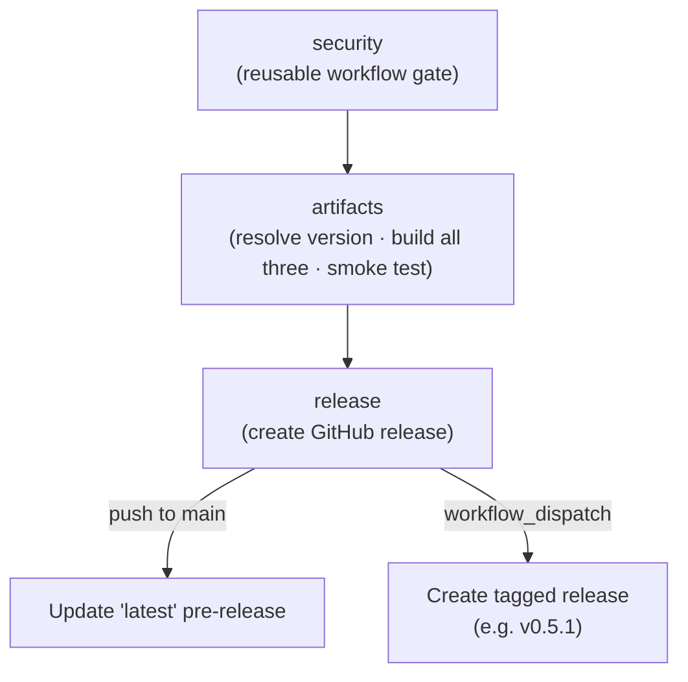
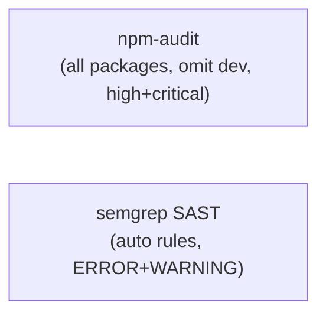
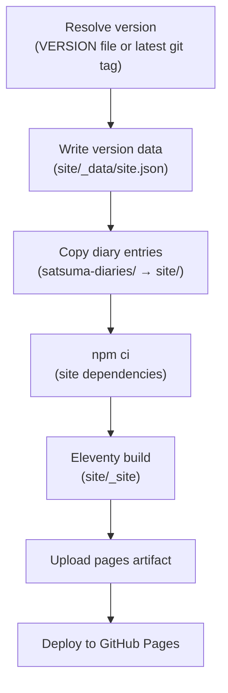
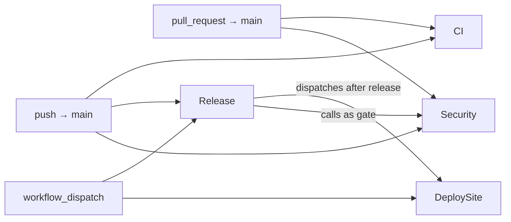

```mermaid
flowchart TD
    install["install\n(npm ci + turbo run build compile)"]

    install --> lint["lint\n(turbo run lint · check:deps · test:scripts)"]
    install --> cli["satsuma-cli\n(turbo test:typecheck + test:coverage · fmt check)"]
    install --> parser["parser\n(generate · corpus · pytest)"]
    install --> vscode["vscode-extension\n(turbo build+compile · extension + LSP tests)"]
    install --> pack["cli-pack-smoke-test\n(pack · global install · version check)"]
    install --> integration["integration-tests\n(cross-consumer parity)"]
    install --> stats["test-stats\n(turbo run test · test-stats.json freshness)"]
    install --> smoke["smoke-tests\n(BDD, global CLI install)"]
    install --> stmexcel["stm-to-excel-skill\n(pytest, global CLI install)"]
    install --> modules["tooling-modules\n(matrix: core · viz-model · viz-backend · viz)"]

    excel["excel-skill\n(pytest, no cache needed)"]

    cli --> report["test-report\n(publish JUnit XML)"]
    parser --> report
    vscode --> report
    excel --> report
    pack --> report
    smoke --> report
    stmexcel --> report

    cli --> coverage["coverage-report\n(matrix, PRs only)"]
    modules --> coverage
    vscode --> coverage

    secrets["secrets\n(gitleaks — no cache needed)"]
```

# CI Workflows

This document describes every GitHub Actions workflow in this repository, when
each runs, what it does, and how the jobs within each workflow depend on each
other.

## Overview

Four workflows cover the full delivery pipeline:

| Workflow | File | Triggers |
|---|---|---|
| [CI](#ci-workflow) | `ci.yml` | Push / PR → `main` |
| [Release](#release-workflow) | `release.yml` | Push → `main` · `workflow_dispatch` |
| [Security](#security-workflow) | `security.yml` | Push / PR → `main` · called by Release |
| [Deploy Site](#deploy-site-workflow) | `deploy-site.yml` | `workflow_dispatch` — auto-dispatched by Release, or manual |

CI and Release both fire on every push to `main`. CI validates the code;
Release builds and publishes the distributable artifacts (CLI tarball and VS
Code `.vsix`). The Security workflow is also invoked directly by Release as a
gate — it is not merely a CI concern.

---

## CI Workflow

**File:** `.github/workflows/ci.yml`
**Triggers:** push to `main`, pull requests targeting `main`

The CI workflow verifies that the whole repository is correct: all tests pass,
generated files are up to date, the CLI tarball installs cleanly, and no
secrets are present.

Two caches carry work between jobs and between runs:

- a **workspace blob** keyed on the commit SHA, saved by `install` and restored by
  every downstream job, so no job reinstalls dependencies;
- **Turborepo's content-hash cache** (`.turbo`), persisted per job under
  `turbo-<job>-<os>-<sha>` with a `turbo-<job>-<os>-` restore-key. It is what lets
  a commit touching one package skip an unaffected package's suite. The keys are
  namespaced per job because a local cache is not shared between jobs (there is no
  remote cache — ADR-049), so a single key would have every job racing to save and
  overwriting the others' entries.

Warm, the pipeline is ~1m56s; cold (new cache keys) ~3m36s. It was 4m35s before
Feature 42.

### Job graph



### Jobs

#### `install`

Runs `npm run ci:all` — `npm ci` against the single root lockfile, then
`turbo run build compile` over all eleven workspace packages. The order comes
from the dependency graph in the manifests; it is not written down here or
anywhere else as a sequence (ADR-049). This job used to spell that sequence out
step by step, which was one of three copies of it that had to be kept in sync.

Saves the full workspace — `node_modules`, `dist`, generated sources, and WASM
artifacts — as a cache keyed on `github.sha`, which all downstream jobs restore
rather than reinstalling, plus its own `.turbo` cache so an unchanged package is
not rebuilt on the next push.

#### `lint`

Restores the workspace cache and runs the full lint suite:

- **ESLint** over all TypeScript and JavaScript sources
- **markdownlint-cli2** over all Markdown files
- **yamllint** over `.github/workflows/`
- **ruff** over Python scripts and skill code

Python lint tools (`yamllint`, `ruff`) are installed directly; they are not in
the workspace cache.

#### `satsuma-cli`

Runs `@satsuma/scenario-gen`'s tests first (a broken generator would otherwise
surface as dozens of unexplained property failures), then
`turbo run test:typecheck` and `turbo run test:coverage` for `satsuma-cli`, then
verifies that all files in `examples/` are formatter-clean
(`satsuma fmt --check`).

Both turbo invocations are cacheable, which is the point: this was the pipeline's
second-longest job, almost always re-running a suite whose inputs had not changed.
Its coverage report and JUnit XML are declared task outputs, so a cache hit
restores both — which is why the XML is written to
`tooling/satsuma-cli/test-results/` rather than the repo root, a path Turborepo
cannot express as a package's output. Current count is in
[`test-stats.json`](../../test-stats.json).

#### `parser`

Runs four distinct checks:

1. **`npm run generate`** — regenerates the parser from `grammar.js`
2. **Generated-sources check** — fails if `src/` differs from the committed
   state (catches uncommitted grammar changes)
3. **Conflict count check** — compares the grammar's conflict count against
   `CONFLICTS.expected`; fails if they diverge
4. **Corpus tests** — `npm run test:corpus` (`tree-sitter test --wasm`; there is
   no native parser, ADR-002). Count in [`test-stats.json`](../../test-stats.json)
5. **pytest suite** — fixture tests, CST consumer tests, and smoke tests over
   the full example corpus

Test results are uploaded as JUnit XML.

#### `vscode-extension`

Validates the extension manifest and TextMate grammar, runs the TextMate fixture
and golden tests, then
`npx turbo run build compile --filter=vscode-satsuma --filter=@satsuma/lsp`,
then the LSP server's typecheck and test suite.

That single turbo invocation replaced four hand-ordered steps — build the grammar
WASM, build the extension, build `satsuma-cli` "(needed by LSP formatting
provider)", then `npx tsc` in the LSP — which together were this job's own copy of
the cross-package build order. `compile` is `@satsuma/lsp`'s `tsc` output, which
its tests load; the package's `build` is the esbuild bundle it ships.

Test results are uploaded as JUnit XML.

#### `cli-pack-smoke-test`

Verifies that the CLI tarball can be installed end-to-end. It runs `npm run
pack` (which replaces the workspace symlink for `@satsuma/core` with a real copy
before packing — see [below](#packaging-why-the-symlink-must-be-replaced)), installs
the resulting `satsuma-cli.tgz` globally, and checks that `satsuma --version`
succeeds. This job prevents tarball regressions from reaching the release
workflow.

#### `excel-skill`

Runs the Python tests for the `excel-to-satsuma` Agent Skill. This job does
not need the workspace cache — it installs only `pytest` and `openpyxl`
directly.

#### `test-report`

Aggregates JUnit XML artifacts from every job that produces them — `satsuma-cli`,
`parser`, `vscode-extension`, `excel-skill`, `stm-to-excel-skill`,
`cli-pack-smoke-test` and `smoke-tests` — and publishes a
consolidated check using `dorny/test-reporter`. Runs even if upstream jobs
fail (`if: always()`).

#### `secrets`

Runs `gitleaks` over the full commit history (full checkout via
`fetch-depth: 0`) to detect any committed secrets. Independent of the build
cache.

---

## Release Workflow

**File:** `.github/workflows/release.yml`
**Triggers:**
- Push to `main` → updates the rolling `latest` pre-release
- `workflow_dispatch` with a `version` input (e.g. `v0.5.1`) → creates a
  tagged release with changelog-extracted release notes

### Job graph



### Jobs

#### `security` (reusable)

Calls `.github/workflows/security.yml` as a required gate before any build
work begins. The CLI tarball, standalone LSP tarball, and `.vsix` are only built
if security passes.

#### `artifacts`

Resolves one build version before any package is built. A push to `main` uses
`<VERSION>-dev.<short-sha>` and injects it into the CLI, LSP, and extension
manifests inside the ephemeral CI checkout. A workflow-dispatched release uses
the clean `VERSION`; the dispatch is the release signal because the workflow
creates the tag only after the artifacts pass. Development injection never
changes `VERSION`, the root lockfile, changelog, or site data.

The job installs and builds all workspace packages, then
`scripts/build-artifacts.sh` produces all three distributables. CLI and LSP
prebuilds bake the same version into their executables, and the VSIX packager
sets it in a temporary staging manifest so local packaging does not dirty the
tracked release manifest.

After packing, the job installs the two tarballs. It asserts that `satsuma
--version` equals the resolved build version and drives a real LSP initialize
round-trip that checks `serverInfo.version`. The CLI/LSP pack verifiers and
VSIX staging packager carry that same value into their artifact manifests
before all three artifacts are uploaded for the `release` job.

Local builds follow the same rule without changing tracked package manifests:
HEAD at the exact matching `v<VERSION>` tag is clean; every other branch or
worktree build reports `<VERSION>-dev.<short-sha>`.

#### `release`

Downloads all three artifacts and creates a GitHub release:

- **On `workflow_dispatch`:** verifies that the requested tag matches `VERSION`
  and the CLI, standalone LSP, and VS Code extension package versions. It then
  extracts non-placeholder release notes from `CHANGELOG.md` (the section
  starting `## vX.Y.Z —`), creates the tagged release, and attaches all three
  artifacts.
- **On push to `main`:** deletes any existing `latest` pre-release (including
  its tag), then recreates it as a `--prerelease` with install instructions,
  attaching all three artifacts.

### Release artifacts

Both release types attach the same three artifacts, renamed with the release
tag as a suffix (`<tag>` is `latest` for the pre-release, or the version tag
such as `v0.9.0` for tagged releases):

| Artifact | Install method |
|---|---|
| `satsuma-cli-<tag>.tgz` | `npm install -g <url>` |
| `satsuma-lsp-<tag>.tgz` | `npm install -g <url>` |
| `vscode-satsuma-<tag>.vsix` | `code --install-extension vscode-satsuma-<tag>.vsix` |

The unsuffixed names (`satsuma-cli.tgz`, `satsuma-lsp.tgz`, and
`vscode-satsuma.vsix`) exist only as local pack outputs and CI workflow
artifacts — they are never the download filenames on a GitHub release. Install
instructions must use the suffixed names. The filename's `latest` identifies
the rolling release channel; the version reported by the installed artifact
identifies its exact source commit.

### Creating a tagged release

1. Run `./scripts/bump-version.sh X.Y.Z`. It synchronizes the releasable package
   versions and moves the accumulated `Unreleased` notes beneath a dated
   `## vX.Y.Z — <date>` heading, leaving a fresh `Unreleased` section.
2. Review and merge the resulting release-preparation PR.
3. Trigger **Actions → Release → Run workflow** with the version tag (e.g.
   `v0.5.1`).

The workflow fails before building artifacts if the tag differs from `VERSION`
or any releasable package. It also fails if no matching changelog section exists
or the section contains only whitespace or placeholder comments.

---

## Security Workflow

**File:** `.github/workflows/security.yml`
**Triggers:** push to `main`, pull requests targeting `main`, `workflow_call`
(called by Release)

The Security workflow runs two independent checks. It is designed to be both a
standalone CI job and a reusable gate callable from Release.

### Job graph



These jobs are independent and run in parallel.

### Jobs

#### `npm-audit`

Installs all workspace dependencies and runs `npm audit --omit=dev
--audit-level=high` over every tracked lockfile, discovered with
`git ls-files '*package-lock.json'`. Since Feature 42 there are exactly two: the
root one covering all eleven `tooling/*` packages, and `site/`'s, which is
deliberately separate. Known findings can be acknowledged
in `.security-allowlist.yml` — the `scripts/parse-security-allowlist.py` script
extracts the allowlist before the audit runs.

#### `semgrep`

Runs Semgrep SAST in a container using the `auto` ruleset at `ERROR` and
`WARNING` severity. Produces a SARIF file that is uploaded to GitHub's code
scanning dashboard (requires GitHub Advanced Security). Allowlisted rule IDs
are excluded via `--exclude-rule` flags.

##### Why the release gate does not upload SARIF

GitHub identifies a code scanning **configuration** by the calling workflow file
plus the job id, not by the workflow that defines the job. When Release invokes
this workflow, the upload would therefore land under
`.github/workflows/release.yml:semgrep` rather than
`.github/workflows/security.yml:semgrep`.

Because Release only runs on pushes to `main`, that second configuration would
exist on the default branch but never on a pull request. Code scanning cannot
diff a PR against a baseline configuration the PR does not produce, so it gives
up: the **Semgrep OSS** check reports `1 configuration not found` and resolves as
_neutral_ — visible in the PR checks list as `skipping`, gating nothing.

Release therefore passes `skip_sarif_upload: true` and uses the workflow purely
as a gate. The push-triggered Security run publishes the SARIF for that same
commit, so exactly one configuration is ever written to `main`. See sl-1wtv.

---

## Deploy Site Workflow

**File:** `.github/workflows/deploy-site.yml`
**Triggers:**
- `workflow_dispatch` — either dispatched manually, or automatically by the
  `release` job in `release.yml` after every release (tagged or the rolling
  `latest` pre-release). There is no `on: release` trigger: GitHub never
  raises that event for a release created with `GITHUB_TOKEN`, so it would
  never fire in this repo (rv-tmb4) — the direct dispatch is what actually
  deploys the site.

### Job graph



### Notes

- The site is deployed to GitHub Pages under the `github-pages` environment.
- Version is resolved from a `VERSION` file at the repo root if present;
  otherwise falls back to the most recent `v*` git tag.
- The `pages` concurrency group prevents overlapping deployments; in-progress
  deploys are not cancelled if a new one is queued.
- The Release workflow dispatches this workflow after **every** release,
  including the rolling `latest` pre-release it creates on each push to
  `main`, so the site never lags behind the most recent release.

---

## Workflow Trigger Summary



---

## Packaging: Why the Symlink Must Be Replaced

`@satsuma/core` is declared as `"@satsuma/core": "*"` and resolved by npm
workspaces, which links it as a symlink inside `node_modules/@satsuma/core`
pointing at the sibling package directory. (It was a `file:../satsuma-core`
spec before Feature 42; the symlink, and therefore this problem, is the same
either way.) When `npm pack` bundles the dependencies
(required for a self-contained distributable), it follows the symlink and
produces tarball entries such as:

```
package/../satsuma-core/node_modules/web-tree-sitter/...
```

npm rejects these paths on install with `TAR_ENTRY_ERROR path contains '..'`.

The fix, implemented in `tooling/satsuma-cli/scripts/pack.js`, is to replace
the symlink with a real directory copy before calling `npm pack`. This gives
the packer a self-contained directory tree with no `..` references. The same
script is used locally (`npm run pack`) and in every CI environment, so local
and CI produce identical tarballs.

`scripts/verify-pack.js` enforces this at pack time: if any tarball entry
contains `..`, it throws with a clear error before the artifact is uploaded.
